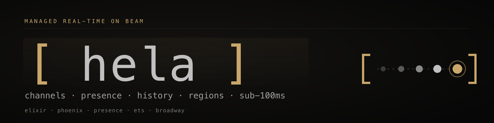

<p align="center">
  <a href="https://github.com/v0id-user/hela">
    <picture>
      <source type="image/webp"
              srcset="apps/web/public/brand/png/webp/banner@2x.webp"/>
      
    </picture>
  </a>
</p>

<p align="center">
  <strong>Managed real-time infrastructure on BEAM.</strong><br/>
  Regional clusters · channels · presence · history · sub-100ms · flat monthly pricing.<br/>
  <em>Open source end to end: the managed service and self hosted paths ship from this tree.</em>
</p>

<p align="center">
  <a href="https://github.com/v0id-user/hela/actions/workflows/ci.yml"></a>
  <a href="LICENSE"></a>
  
  
  
</p>

---

This repo is the whole thing: the data plane, the control plane, four
SDKs, the marketing site, and the customer dashboard — one monorepo,
four independently deployable apps.

Competing on realtime with well-funded incumbents is unforgiving. **hela
is the open source alternative** for teams that want the same
primitives without a black box: read the server, run your own
regions, diff the wire protocol, and own the whole stack under the
AGPL (or a commercial license if that fits your situation). The
product you see in production is the code in this repository, not a
separate enterprise edition.

```
hela/
├── apps/
│   ├── gateway/      Elixir · the realtime data plane (per-region Railway service)
│   ├── control/      Elixir · signup, billing, project CRUD, Polar webhook
│   ├── web/          React · marketing site + live playground
│   └── app/          React · customer dashboard
├── packages/
│   ├── schemas/      JSON Schema + OpenAPI — single source of truth
│   ├── sdk-gen/      codegen: schemas → SDK type modules
│   ├── sdk-js/       @hela/sdk — the published TypeScript SDK
│   ├── sdk-types/    @hela/sdk-types — wire-format types, dependency-free
│   ├── sdk-py/       hela (PyPI) — async Python SDK, Pydantic v2
│   ├── sdk-go/       hela-go — Go SDK
│   ├── sdk-rs/       hela (crates.io) — Rust SDK, tokio
│   └── ui/           @hela/ui — shared design system (silver on black)
├── infra/
│   ├── railway/      primary deploy target: Railway Terraform
│   └── fly/          secondary: per-region gateway fly.toml (standby)
├── docs/             architecture notes, runbooks, SDK guides
├── docker-compose.yml  local dev (postgres + gateway + control + mailpit)
└── Makefile          one-liners for everyday work
```

<details>
<summary><strong>ASCII banner</strong> (for terminal READMEs, release notes, Discord embeds)</summary>

```
    ██╗  ██╗███████╗██╗      █████╗
    ██║  ██║██╔════╝██║     ██╔══██╗
    ███████║█████╗  ██║     ███████║
    ██╔══██║██╔══╝  ██║     ██╔══██║
    ██║  ██║███████╗███████╗██║  ██║
    ╚═╝  ╚═╝╚══════╝╚══════╝╚═╝  ╚═╝

    [ · · · ● ]   managed real-time on BEAM
```

</details>

## Quick start (local)

```
make setup       # postgres in docker, elixir deps, db migrate, bun install
make dev         # runs all 4 apps (concurrently, one terminal)
```

You get:

| app         | url                    | what it is                    |
| ----------- | ---------------------- | ----------------------------- |
| control     | http://localhost:4000  | REST API for signup/projects  |
| gateway     | http://localhost:4001  | the realtime cluster (WS + REST) |
| web         | http://localhost:5173  | the marketing site            |
| app         | http://localhost:5174  | the customer dashboard        |
| mailpit     | http://localhost:8025  | outbound email preview        |

Polar webhooks in dev:

```
make polar.listen   # prints setup hint for Polar webhook endpoint
```

Billing runs on [Polar](https://polar.sh) (currently on the sandbox
environment). Stripe was evaluated early and dropped — don't look
for Stripe plumbing, there isn't any.

## The four apps, in one paragraph each

**gateway** is the data plane. Phoenix 1.8 + Bandit, Channels + Presence
+ PubSub, ETS ring buffers per (project, channel), Broadway batching into
a per-region Postgres. `dns_cluster` meshes replicas within a region.
One Railway service per region (single `ams` service in production
today; other region slugs are reserved but not yet deployed). Stateless
except for ETS. Owns the `/socket` WebSocket surface, the public
`/playground/*` endpoints, and a `/_internal/*` surface that control
pushes project + API-key state to.

**control** is the control plane. Accounts, projects, API keys, Polar
customer + subscription management, JWT public-key registration. Single
global deployment. Knows about each region's gateway URL and fans out
project upserts via `x-hela-internal` signed POSTs so the data plane's
local mirror stays fresh without cross-region BEAM clustering.

**web** is the marketing site. Every demo on the page hits a real gateway:
hero has a live `hello:world` channel, the five primitive demos each target
a sandboxed `proj_public` project, the region selector opens fresh
sockets. Also hosts `/how` (architecture, inline SVG diagrams) and
`/dashboard` (live state of the public gateway, same panels a customer
gets for their project).

**app** is the customer dashboard. List/create projects, pick a region,
register a JWK, rotate API keys, view billing and usage. Talks to control
for state, talks to whatever gateway region their project is in for live
metrics.

## The five primitives

Everything the product does distils to these. Each has a module in the
gateway and a matching demo on the landing page:

1. **channels** — publish/subscribe on a named topic, all in-region.
   `Hela.Channels.publish/1`.
2. **presence** — CRDT-replicated per-channel roster.
   `Phoenix.Presence` via `Hela.Presence`.
3. **history** — last N messages per channel in ETS, cursor-paginated
   back to Postgres. `Hela.Channels.history/4`.
4. **sequencing** — UUIDv7 on every message, same id everywhere.
   `Hela.ID`.
5. **auth** — short-lived JWT grants verified against customer-registered
   JWKs. `Hela.Auth.JWT`, playground HS256 via `Hela.Auth.Playground`.

## Tenancy + billing shape

- **account** — one per signup, one Polar customer.
- **project** — the billable unit, one Polar subscription. Fixed
  region, fixed JWK. Different projects on the same account can be
  on different tiers.
- **channel** — runtime only, namespaced by project. Topic is
  `chan:<project_id>:<channel_name>`; the JWT's `pid` claim is enforced
  against the topic on every join.

Tier caps in `packages/sdk-types` and `Hela.Quota`. Monthly messages over
the tier cap are billed as overage at $0.50 per million. Connection caps
are hard.

## Pricing

| Tier        | $/mo    | Connections | Messages/mo | Regions             | History  | SLA    |
| ----------- | ------- | ----------- | ----------- | ------------------- | -------- | ------ |
| Free        | $0      | 100         | 1M          | 1                   | 1k msgs  | none   |
| Starter     | $19     | 1,000       | 10M         | 1                   | 10k msgs | none   |
| Growth      | $99     | 10,000      | 100M        | 1                   | 100k msgs| 99.9%  |
| Scale       | $499    | 100,000     | 1B          | up to 3, replicated | 1M msgs  | 99.95% |
| Enterprise  | contact | custom      | custom      | all                 | custom   | 99.99% |

## Deploy

**Currently deployed on Railway.** Live URLs:

- web:     https://web-production-f24fc.up.railway.app
- app:     https://app-production-1716a.up.railway.app
- gateway: https://gateway-production-bfdf.up.railway.app
- control: https://control-production-059e.up.railway.app

One `hela` Railway project, 5 services (postgres, gateway, control,
web, app). Polar sandbox for billing. CI/CD auto-deploys on push to
main via `.github/workflows/ci.yml` — tests run first, then per-service
`railway up` with a scoped `RAILWAY_TOKEN` secret.

### CI flow

```
push to main
  │
  ├─ test-gateway (mix compile+test against ephemeral PG)
  ├─ test-control (ditto)
  └─ test-js      (bun install + build SDK + build web/app)
              │
              └─→ deploy-control ─┬─→ deploy-gateway
                                   ├─→ deploy-app
                                   └─→ deploy-web
```

### Environments

PRs run the full lint + test + build surface but do **not** deploy.
Only pushes to `main` roll to production:

| GitHub env   | Railway env  | Triggers           | Review required |
| ------------ | ------------ | ------------------ | --------------- |
| `production` | `production` | push to `main`     | admin-bypass    |

The Railway `dev` environment exists but has no live service
instances, so PR / Dependabot contexts (which don't get a Railway
token) skip deploy jobs entirely.

Each deploy job has a `concurrency:` group scoped by service so
overlapping pushes never race each other. After `railway up`, each
job polls the service's `/health` endpoint for 60×5s before the job
is allowed to go green — a failed Railway build now fails CI instead
of silently looking healthy.

### Platform-agnostic

The Dockerfiles are vanilla. Railway is the current target; Fly.io
configs are in `infra/fly/` for when BEAM clustering over IPv6 +
multi-region is worth the move. `packages/sdk-types.REGIONS` and the
SDK don't assume a host — swap `dns_cluster` for `libcluster` with a
different strategy and the same images run on AWS, Hetzner, Kubernetes,
wherever.

## SDKs

Four languages, one wire protocol. All four type modules are
generated from `packages/schemas/` via `make sdk.gen`; transport and
the domain API are hand-written per language. The recipe for adding a
fifth is in [`docs/sdk/adding-a-language.md`](docs/sdk/adding-a-language.md).

| package            | lang       | registry                  | runtime                      |
| ------------------ | ---------- | ------------------------- | ---------------------------- |
| `@hela/sdk`        | TypeScript | npm                       | browser + Node (phoenix.js)  |
| `hela`             | Python     | PyPI                      | asyncio (`websockets` + `httpx`) |
| `hela-go`          | Go         | `go install`              | `coder/websocket`            |
| `hela` (crate)     | Rust       | crates.io                 | `tokio-tungstenite` + `reqwest` |

Docs: [`docs/sdk/`](docs/sdk/).

## Contributing

Read [`CLAUDE.md`](CLAUDE.md) first — it's the rule set for every
agentic or human contributor. Key points:

- **Small, focused commits.** One logical change per commit.
- **Schemas are the source of truth.** `_generated/` modules are
  never hand-edited; run `make sdk.gen`.
- **Subject lines match `^[A-Za-z0-9 ,:]{4,72}$`.** Enforced by
  commit-msg hook + CI. Conventional-Commit prefixes allowed;
  parens and hyphens aren't.
- **`lefthook install` once** — pre-commit runs format, lint, and
  tests for the languages you touched.

See [`CONTRIBUTING.md`](CONTRIBUTING.md) for the full guide.

## Brand

Source SVGs live in [`apps/web/public/brand/`](apps/web/public/brand/).
Rasterised PNGs (at 1×, 2×, and 4K where it matters) live under
`brand/png/`. WebP copies of every 1× / 2× for the web-delivery path
are under `brand/png/webp/`. Everything is served verbatim at
`/brand/...` on the marketing site.

| asset | what it is | SVG | PNG sizes | WebP |
| ----- | ---------- | --- | --------- | ---- |
| mark     | 3-dot presence roster in gold brackets (favicon-safe) | [`mark.svg`](apps/web/public/brand/mark.svg) | 128 · 256 · 512 · 1024 · 2048 · 4096 (square) | `mark.webp` · `mark@2x.webp` |
| signal   | kinetic timeline mark — trailing events + live accent | [`signal.svg`](apps/web/public/brand/signal.svg) | 512×256 · 1024×512 · 2048×1024 · 2560×1280 | `signal.webp` · `signal@2x.webp` |
| wordmark | `[ hela ]` in gold + silver mono | [`wordmark.svg`](apps/web/public/brand/wordmark.svg) | 720×160 · 1440×320 · 2880×640 | `wordmark.webp` |
| lockup   | mark + wordmark + tagline | [`lockup.svg`](apps/web/public/brand/lockup.svg) | 960×160 · 1920×320 · 3840×640 | `lockup.webp` |
| banner   | hero strip, used at the top of this README | [`banner.svg`](apps/web/public/brand/banner.svg) | 1280×320 · 2560×640 · 3840×960 (4K) | `banner.webp` · `banner@2x.webp` |
| avatar   | profile picture for GitHub / Twitter / Discord | [`avatar.svg`](apps/web/public/brand/avatar.svg) | 400² · 800² · 2048² · 4096² | `avatar.webp` · `avatar@2x.webp` |
| og       | social share card | [`og.svg`](apps/web/public/brand/og.svg) | 1200×630 · 2400×1260 · 3840×2016 (4K) | `og.webp` · `og@2x.webp` |
| favicon  | simplified 2-dot mark tuned for ≤32 px | [`favicon.svg`](apps/web/public/brand/favicon.svg) | 32 · 180 · 512 (maskable) | — |

Colour palette:

- background `#0a0a0a`
- accent (brackets, live dot) `#c9a76a`
- type / main marks `#c0c0c0`
- muted / trailing dots `#333`, `#555`, `#888`

Typography stack: `"SF Mono", "JetBrains Mono", "Menlo", "DejaVu Sans Mono", monospace`.

To re-render everything after editing any SVG:

```sh
bash scripts/brand_render.sh
```

That script rasterises every SVG at every documented size, runs
`oxipng -o 4` to shrink the PNGs without loss, and emits a WebP at
1× for each asset. Requires `rsvg-convert`, `oxipng`, and `cwebp`
(`brew install librsvg oxipng webp` on macOS).

### Brand assets are not AGPL

The code in this repo is AGPL-3.0-or-later. The **brand assets**
under `apps/web/public/brand/` are a trademark carve-out — see
[`apps/web/public/brand/LICENSE.md`](apps/web/public/brand/LICENSE.md)
and the repo-level [`NOTICE.md`](NOTICE.md) for the full terms.

TL;DR: you can link the assets unmodified to refer to hela. You
can't redraw them, use them as your own product's identity, imply
endorsement, or ship merchandise without written permission. If
you're running a public fork, please pick your own name and
replace everything in the brand directory. Permission requests:
`hey@v0id.me`.

## License

Code is [AGPL-3.0-or-later](LICENSE). If you run a modified version
of hela as a public service, the AGPL requires you to make your
modifications available to your users. This is deliberate — the
backend is copyleft so the community benefits from anyone's
improvements, even if those improvements only ship as a hosted
service.

Brand assets under `apps/web/public/brand/` are **not** AGPL — see
[`NOTICE.md`](NOTICE.md).

If the AGPL isn't workable for your use case and you want a
commercial license, email `hey@v0id.me`.
